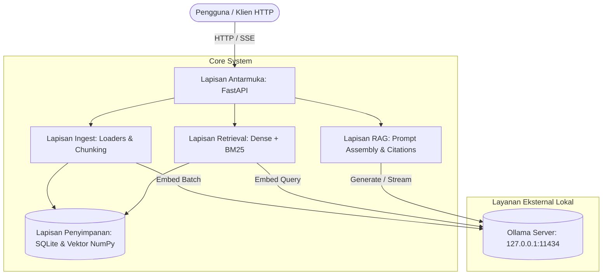

# Arsitektur Sistem

Dokumen ini menjelaskan struktur arsitektur, alur data, skema basis data, dan keputusan desain teknis pada sistem Personal Document Assistant.

---

## 1. Diagram Arsitektur Tingkat Tinggi

Sistem dirancang dalam empat lapisan yang beroperasi secara terpisah di komputer lokal:



---

## 2. Rincian Lapisan Sistem

### 2.1 Lapisan Ingest (`app/loaders.py`, `app/indexing.py`)
Lapisan ini bertanggung jawab mengekstrak konten tekstual dari berkas dokumen dan membaginya menjadi unit-unit teks (*chunk*):

1. **Format Loader**:
   - **PDF**: Diekstrak per halaman menggunakan PyMuPDF (`fitz`). Halaman yang menghasilkan teks kurang dari `OCR_MIN_CHARS` (default: 50 karakter) ditandai sebagai `needs_ocr=True`.
   - **DOCX**: Diekstrak per paragraf dan tabel menggunakan `python-docx`, mempertahankan penanda bab atau heading.
   - **XLSX**: Diekstrak per lembar kerja menggunakan `openpyxl`. Setiap kelompok `XLSX_ROW_CHUNK` baris (default: 30 baris) dikonversi menjadi format tabel Markdown lengkap dengan baris header.
   - **Markdown & TXT**: Diekstrak secara sekuensial dengan mempertahankan hierarki heading.

2. **Chunking Rekursif**:
   Teks dipotong dengan ukuran target `CHUNK_SIZE` karakter (default: 800) dan tumpang-tindih `CHUNK_OVERLAP` karakter (default: 100). Pemotongan memprioritaskan batas paragraf ganda (`\n\n`), paragraf tunggal (`\n`), kalimat (`. `), dan spasi kata.

3. **Deduplikasi dan Dokumen Kembar**:
   Sebelum pemrosesan, hash SHA-256 berkas dihitung. Jika konten berkas identik dengan dokumen yang sudah terindeks namun berada di jalur direktori berbeda (dokumen kembar), sistem tidak menghitung ulang embedding. Dokumen baru dicatat pada tabel dokumen dan jalur berkasnya ditambahkan ke daftar `also_in` pada chunk terkait.

---

### 2.2 Lapisan Penyimpanan (`app/store.py`)

Penyimpanan data lokal dibagi menjadi dua komponen:

#### Basis Data Relasional & Indeks Kata Kunci (SQLite: `data/index/index.db`)
SQLite digunakan dalam mode Write-Ahead Logging (WAL) untuk menjamin persistensi data dan konkurensi pembacaan:

- **Tabel `documents`**:
  - `doc_id` (TEXT, Primary Key): Pengenal unik dokumen berbasis slug jalur berkas.
  - `filename` (TEXT): Nama berkas.
  - `rel_path` (TEXT, Unique): Jalur relatif dari root direktori dokumen.
  - `file_type` (TEXT): Ekstensi berkas (`.pdf`, `.docx`, `.xlsx`, `.md`, `.txt`).
  - `file_hash` (TEXT): Hash SHA-256 dari isi berkas.
  - `file_size` (INTEGER): Ukuran berkas dalam byte.
  - `mtime` (REAL): Timestamp waktu modifikasi terakhir.
  - `total_chunks` (INTEGER): Jumlah potongan teks yang dihasilkan.
  - `needs_ocr` (BOOLEAN): Status apakah dokumen membutuhkan OCR.
  - `status` (TEXT): Status pengindeksan (`indexed`, `failed`, `needs_ocr`).
  - `error_message` (TEXT): Pesan error jika pengindeksan gagal.
  - `indexed_at` (TIMESTAMP): Waktu pengindeksan selesai.

- **Tabel `chunks`**:
  - `chunk_id` (TEXT, Primary Key): Format `{doc_id}_c{idx:04d}`.
  - `doc_id` (TEXT, Foreign Key ke `documents.doc_id` ON DELETE CASCADE).
  - `idx` (INTEGER): Urutan potongan dalam dokumen.
  - `text` (TEXT): Konten teks potongan.
  - `char_count` (INTEGER): Panjang karakter teks.
  - `location` (TEXT): Keterangan lokasi asal (misal `Halaman 2`, `sheet: Tabungan`).
  - `also_in` (TEXT): JSON array berisi daftar jalur berkas kembar.

- **Tabel Virtual `chunks_fts` (FTS5 SQLite)**:
  - Menyimpan kolom `text`, `location`, dan `filename` untuk pencarian leksikal berbasis BM25.
  - Menggunakan tokenizer unicode61 standar.

- **Tabel `settings`**:
  - Menyimpan pasangan kunci-nilai metadata sistem, termasuk `index_version` dan waktu pembaruan terakhir.

#### Indeks Vektor Dense (`data/index/vectors.npy` dan `chunk_ids.npy`)
- Vektor embedding berdimensi 1024 (dari model `bge-m3`) disimpan dalam berkas array NumPy (`vectors.npy`) dengan tipe data `float32`.
- Berkas `chunk_ids.npy` memetakan baris array vektor ke `chunk_id` yang bersesuaian pada basis data SQLite.
- Seluruh vektor dinormalisasi L2 saat penyimpanan sehingga perhitungan kemiripan kosinus (*cosine similarity*) disederhanakan menjadi operasi perkalian matriks (*dot product*):

$$\text{similarity}(q, v) = q \cdot v$$

---

### 2.3 Lapisan Retrieval dan RAG (`app/retrieval.py`, `app/rag.py`)

#### Mekanisme Pencarian Hybrid
Pencarian menggabungkan dua sinyal relevansi independen:

1. **Dense Retrieval**:
   Pertanyaan diubah menjadi vektor menggunakan `bge-m3`. Vektor dikalikan dengan seluruh matriks vektor yang tersimpan untuk memperoleh skor kemiripan kosinus pada rentang [-1.0, 1.0].
2. **Sparse Retrieval (BM25)**:
   Pertanyaan diurai menjadi kueri pencarian FTS5 untuk menghitung skor leksikal BM25 terhadap tabel `chunks_fts`.
3. **Reciprocal Rank Fusion (RRF)**:
   Kandidat dari kedua metode diberi peringkat ulang berdasarkan rumus:

$$RRF(d) = \frac{1}{k + rank_{dense}(d)} + \frac{1}{k + rank_{bm25}(d)}$$

Dengan konstanta $k = 60$ (dikonfigurasi via `RRF_K`).

#### Gerbang Penolakan Relevansi (*Relevance Gate*)
Untuk mencegah halusinasi model dan menghemat komputasi inferensi CPU:
- Jika skor dense tertinggi $< \text{MIN\_DENSE\_SCORE}$ (default: 0.35) **DAN** skor BM25 tertinggi $< \text{MIN\_BM25\_SCORE}$ (default: 0.0), kueri diklasifikasikan sebagai *out-of-domain*.
- Sistem langsung mengembalikan respons standar: `"Tidak ditemukan di dokumen Anda."` dengan status `refused=True` tanpa memanggil server Ollama.

#### Format Konteks dan Penanganan Injeksi Prompt
Potongan teks dokumen yang terpilih dibungkus dalam tag struktural XML:

```
KONTEKS DOKUMEN:
<dokumen no="1" sumber="[nama_berkas | lokasi]">
isi potongan teks...
</dokumen>
```

Instruksi sistem menetapkan batasan ketat bahwa model dilarang mengikuti instruksi apa pun yang tertulis di dalam tag dokumen, dan hanya boleh memanfaatkan informasi faktual di dalamnya.

#### Penanganan Sitasi
Model diinstruksikan menyertakan penanda sitasi numerik `[1]`, `[2]` pada klausa jawaban. Modul pascapemrosesan memetakan angka sitasi tersebut ke metadata dokumen sumber yang sesuai dan memverifikasi apakah sumber tersebut benar-benar dirujuk (`cited=True`).

---

### 2.4 Lapisan API (`app/api/`)

- Menggunakan framework FastAPI dengan dokumentasi otomatis OpenAPI / Swagger UI.
- **Konkurensi**:
  - Menggunakan `asyncio.Semaphore(MAX_CONCURRENT_CHAT)` untuk membatasi eksekusi chat bersamaan menjadi 1 antrean. Ini mencegah lonjakan penggunaan RAM dan penurunan performa CPU yang parah ketika beberapa kueri masuk bersamaan.
  - Operasi sinkronisasi indeks dilindungi oleh kunci eksklusif (`threading.Lock()`), mengembalikan kode status `409 Conflict` jika sinkronisasi lain sedang berjalan.
- **Streaming**:
  - Endpoint `/api/v1/chat/stream` mengalirkan token jawaban menggunakan Server-Sent Events (SSE) dengan format data JSON bertipe `chunk` dan diakhiri tipe `done` yang memuat metadata sitasi lengkap.
